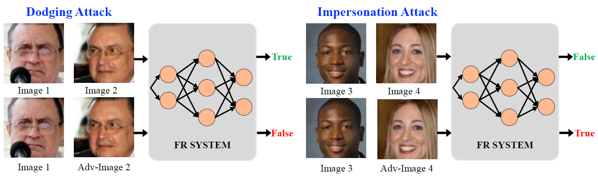
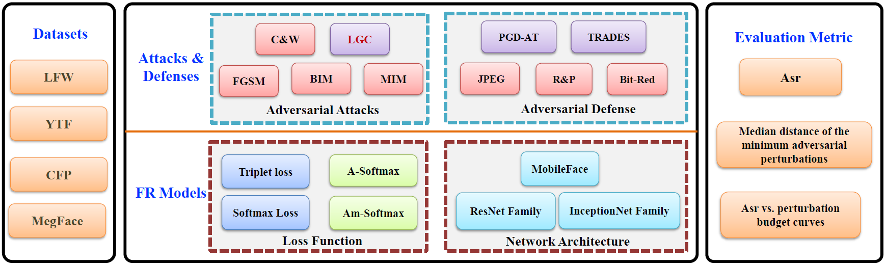
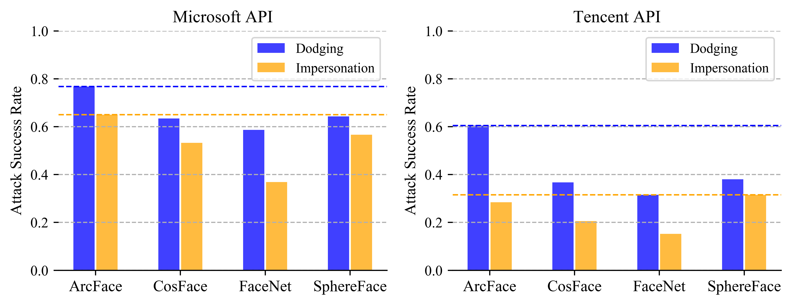

## Face Robustness Benchmark (RobFR)

This repository provides a robustness evaluation on *Face Recognition* by using various adversarial attacks. These evaluations are conducted under diverse adversarial settings, incuding doding and impersonation attacks,  and  attacks, white-box and black-box attacks. More details and some findings can be reffered to the manuscript.

<p align="center">
  
</p>

****
## Contents
* [Introduction](#Introduction)
* [Installation](#Installation)
* [Documentation](#Documentation)
* [Data Preparation](#Data-Preparation)
* [White-Box Benchmark](#White-Box-Benchmark)
* [Black-Box Benchmark](#Black-Box-Benchmark)
* [Black-Box API Benchmark](#Black-Box-API-Benchmark)
* [Acknowledgements](#Acknowledgements)
* [Citation](#Citation)
****

## Introduction

* This repository studies various backbones (*e.g.*, [ResNet](https://arxiv.org/pdf/1512.03385.pdf), [IR](https://arxiv.org/pdf/1512.03385.pdf), [MobileNet](https://arxiv.org/pdf/1704.04861.pdf), [ShuffleNet](https://arxiv.org/pdf/1707.01083.pdf), *etc.*) and various losses (*e.g.*, Softmax,  [SphereFace](https://arxiv.org/pdf/1704.08063.pdf), [CosFace](https://arxiv.org/pdf/1801.09414.pdf), [ArcFace](https://arxiv.org/pdf/1801.07698.pdf), *etc.*). Some trained models and source codes are provided.
* This repository introduces various white-box attacks including FGSM, BIM, MIM, CW, and black-box attack methods including FGSM, BIM, MIM, CIM and LGC, Evolutionary, *etc.* 
* This repository aims to help researchers understand the adversarial robustness and provide a reliable evaluate criteria for robustness of the future works on face recognition.
* Our paper also provides some valuable insights for the design of more robust models in facial tasks, as well as in other metric learning tasks such as image retrieval, person re-identification, *etc*.
* RobFR takes an easily extendable implementation for every module due to independent interface, thus enabling more researchers to conveniently supplement new contents.

<p align="center">
  
</p>

## Installation
* git clone https://github.com/ShawnXYang/Face-Robustness-Benchmark
* pip install -e .
* pip install -r requirements.txt

## Documentation

We provide __API docs__ at https://face-robustness-benchmark.readthedocs.io/.

## Data Preparation
We build our work on previously released data, and support the following datasets (continuously updating): [LFW](https://hal.inria.fr/file/index/docid/321923/filename/Huang_long_eccv2008-lfw.pdf), [YTF](http://www.cs.tau.ac.il/~wolf/ytfaces/WolfHassnerMaoz_CVPR11.pdf), [CFP-FP](http://www.cfpw.io/paper.pdf), [MegaFace](http://megaface.cs.washington.edu/).

<details>
  <summary><mark><font color=darkred> LFW </font></mark></summary>
Put LFW dataset and `pairs.txt` to `data`.

```
data
|---lfw
|     |
|     |---AJ_Cook
|     |     |
|     |     |---AJ_Cook_0001.jpg
|     |
|     |---xxxx
|     |    |
...........
|---pairs.txt

```

The `pairs.txt` can be seen in [here](https://github.com/davidsandberg/facenet/blob/master/data/pairs.txt).

Then you can execute `scripts/align_image_lfw.py` to build aligned versions of LFW dataset(multiple resolutions).

```
data
|---lfw
|---lfw-112x112
|---lfw-160x160
|---lfw-112x96
|---pairs.txt
```
</details>


<details>
  <summary><mark><font color=darkred> YTF </font></mark></summary>

Similarily, the file structure will be as follows:

```
data
|---splits.txt
|---ytf-112x112
|---ytf-160x160
|---ytf-112x96
```
</details>


<details>
  <summary><mark><font color=darkred> CFP </font></mark></summary>


```
data
|---cfp-112x112
|---cfp-160x160
|---cfp-112x96
```
</details>

## White-Box Benchmark


- The median distance of the minimum perturbations against dodging and impersonation attacks under the  and  norms.


|             |      |    |      |      |      |      |      |      |      |  |      |      |      |      |      |
|:-----:|:-----:|:-----:|:-----:|:-----:|:-----:|:-----:|:-----:|:-----:|:-----:|:-----:|:-----:|:-----:|:-----:|:-----:|:-----:|
|              | Clean| FGSM | FGSM  | BIM | BIM  | MIM  | MIM  | CW   |  CW  | FGSM | FGSM | BIM  | BIM  | MIM  | MIM  |
|              |      | dod. | imp. | dod. | imp. | dod. | imp. | dod. | imp. | dod. | imp. | dod. | imp. | dod. | imp. |
| [FaceNet](https://arxiv.org/pdf/1503.03832.pdf)      | 99.2 | 0.92 | 1.17 | 0.59 | 0.66 | 0.66 | 0.73 | 0.54 | 0.61 | 1.75 | 2.14 | 1.17 | 1.31 | 1.28 | 1.42 |
| [SphereFace](https://arxiv.org/pdf/1704.08063.pdf)   | 98.2 | 0.73 | 0.64 | 0.58 | 0.52 | 0.62 | 0.55 | 0.56 | 0.50 | 1.31 | 1.11 | 1.06 | 0.92 | 1.12 | 0.97 |
| [CosFace](https://arxiv.org/pdf/1801.09414.pdf)      | 98.7 | 0.97 | 0.73 | 0.69 | 0.56 | 0.75 | 0.59 | 0.65 | 0.54 | 1.69 | 1.25 | 1.30 | 1.00 | 1.39 | 1.06 |
| [ArcFace](https://arxiv.org/pdf/1801.07698.pdf)      | 99.5 | 1.09 | 0.80 | 0.83 | 0.66 | 0.89 | 0.69 | 0.79 | 0.64 | 1.97 | 1.42 | 1.53 | 1.20 | 1.62 | 1.25 |
| [MobileFace](https://arxiv.org/pdf/1804.07573.pdf)   | 99.5 | 1.11 | 0.62 | 0.75 | 0.50 | 0.83 | 0.53 | 0.71 | 0.49 | 1.98 | 1.12 | 1.44 | 0.94 | 1.55 | 0.97 |
| [MobileNet](https://arxiv.org/pdf/1704.04861.pdf)    | 99.4 | 1.03 | 0.64 | 0.67 | 0.47 | 0.73 | 0.50 | 0.62 | 0.44 | 1.75 | 1.08 | 1.22 | 0.83 | 1.31 | 0.88 |
| [MobileNetV2](https://arxiv.org/abs/1801.04381)  | 99.3 | 0.89 | 0.64 | 0.62 | 0.50 | 0.69 | 0.53 | 0.59 | 0.48 | 1.55 | 1.12 | 1.17 | 0.91 | 1.25 | 0.95 |
| [ShuffleNetV1](https://arxiv.org/pdf/1707.01083.pdf) | 99.5 | 1.12 | 0.53 | 0.67 | 0.41 | 0.75 | 0.44 | 0.62 | 0.39 | 2.02 | 0.97 | 1.28 | 0.77 | 1.39 | 0.80 |
| [ShuffleNetV2](https://arxiv.org/pdf/1807.11164v1.pdf) | 99.2 | 1.06 | 0.62 | 0.66 | 0.45 | 0.72 | 0.48 | 0.61 | 0.43 | 1.86 | 1.08 | 1.23 | 0.84 | 1.31 | 0.88 |
| [ResNet50](https://arxiv.org/pdf/1512.03385.pdf)     | 99.7 | 1.53 | 0.84 | 0.86 | 0.58 | 0.97 | 0.62 | 0.79 | 0.55 | 2.64 | 1.44 | 1.59 | 1.05 | 1.75 | 1.11 |
| [IR](https://arxiv.org/pdf/1512.03385.pdf)   | 99.6 | 1.30 | 1.05 | 0.84 | 0.73 | 0.94 | 0.81 | 0.78 | 0.71 | 2.36 | 1.86 | 1.66 | 1.41 | 1.80 | 1.50 |
| [JPEG](https://arxiv.org/pdf/1608.00853.pdf)  | 99.6 | 2.46 | 2.00 | 1.36 | 1.16 | 1.31 | 1.12 | 0.75 | 0.67 | 4.19 | 3.31 | 2.77 | 2.23 | 2.58 | 2.16 |
| [Bit-Red](https://arxiv.org/pdf/1704.01155.pdf)      | 99.6 | 1.37 | 1.06 | 0.86 | 0.73 | 0.92 | 0.78 | 0.78 | 0.74 | 3.00 | 2.00 | 2.00 | 1.12 | 2.00 | 1.67 |
| [R\|P](https://arxiv.org/pdf/1711.01991.pdf)         | 99.4 | 4.50 | 8.01 | 2.05 | 2.20 | 2.28 | 2.50 | 1.86 | 2.02 | 8.00 | 10.31| 4.56 | 4.77 | 4.25 | 4.59 |
| [PGD-AT](https://arxiv.org/pdf/1706.06083.pdf)       |91.3  | 4.14 | 3.95 | 2.37 | 2.37 | 2.70 | 2.70 | 2.06 | 2.14 | 12.94| 12.38| 10.34| 10.23| 10.83| 10.62|
| [TRADES](https://arxiv.org/pdf/1901.08573.pdf)       | 91.0 | 4.37 | 4.41 | 2.70 | 2.73 | 3.03 | 3.03 | 2.38 | 2.51 | 12.69| 12.12| 10.59| 10.30| 10.97| 10.64|


- The attack success rate vs. perturbation budget curves of the models against *dodging* attacks under the  norm.

<p align="center">
  
</p>

- The attack success rate vs. perturbation budget curves of the models against *impersonation* attacks under the  norm.

<p align="center">
  
</p>

### Running commands
`run_white.sh` provides some command line interfaces to run white-box evaluation. For example, run FGSM evaluation on MobileFace for LFW dataset using  distance as:

```
python benchmark/lfw/FGSM_white.py --distance=l2 --goal=dodging --model=MobileFace --eps=16 --log=log-lfw-FGSM-l2-dodging-MobileFace-white.txt 
```

Then the attack results are saved in `--log`. 

```
adv_img,tar_img,score,dist,success
1.npy,data/lfw-112x112/Abel_Pacheco/Abel_Pacheco_0004.jpg,0.21092090010643005,1.0467989629677874,1
2.npy,data/lfw-112x112/Akhmed_Zakayev/Akhmed_Zakayev_0003.jpg,0.21074934303760529,4.202811928700617,1
3.npy,data/lfw-112x112/Akhmed_Zakayev/Akhmed_Zakayev_0003.jpg,0.21039743721485138,2.1047161963395666,1
4.npy,data/lfw-112x112/Amber_Tamblyn/Amber_Tamblyn_0002.jpg,0.20931993424892426,1.2771732226518993,1
....
```

`score` indicates the similarity predicted by victim model,  `dist` means the minimal adversarial  or  distortion distance, and `success` means whether this attack is successful.


## Black-Box Benchmark

- The attack success rates of the models against black-box dodging attacks under the  norm.

<p align="center">
  
</p>

- The attack success rates of the models against black-box impersonation attacks under the the  norm.

<p align="center">
  
</p>

### Running commands
`run_black.sh` provides some command line interfaces to run white-box evaluation.

```
# generate adversarial examples
python benchmark/lfw/FGSM_black.py --distance=l2 --goal=dodging --model=MobileFace --eps=4 --output=outputs/lfw-FGSM-l2-dodging-MobileFace --batch_size=20
# generate log file
python benchmark/lfw/run_test.py --model=Mobilenet --distance=l2 --anno=outputs/lfw-FGSM-l2-dodging-MobileFace/annotation.txt --log=log-lfw-Mobilenet-FGSM-l2-dodging-MobileFace-black.txt --goal=dodging 

```

After executing the first script, the adversarial examples are saved as png files in `--output`. An annotation file (`annotation.txt`) is also saved in `--output`.

Then `run_test.py` will generate the evaluation log file in `--log`, and the format of the log file is same as log file of **White-Box Evaluation**.

## Black-Box API Benchmark

<p align="center">
  
</p>


## Acknowledgements
- For the training procedure of *Face Recognition*, we mainly refer to the public code from [face.evoLVe.PyTorch](https://github.com/ZhaoJ9014/face.evoLVe.PyTorch).
- To benchmark adversarial robustness on *image classification*, we recommend [RealSafe](https://github.com/thu-ml/realsafe), a Python library for adversarial machine learning research. 

## Citation
If you benefit from our work in your research, please consider to cite the following paper:

    @article{yang2020delving,
        title={Delving into the Adversarial Robustness on Face Recognition},
        author={Yang, Xiao and Yang, Dingcheng and Dong, Yinpeng and Yu, Wenjian and Su, Hang and Zhu, Jun},
        journal={arXiv preprint arXiv:2007.04118},
        year={2020}
    }
